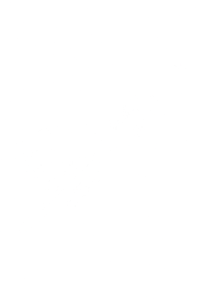
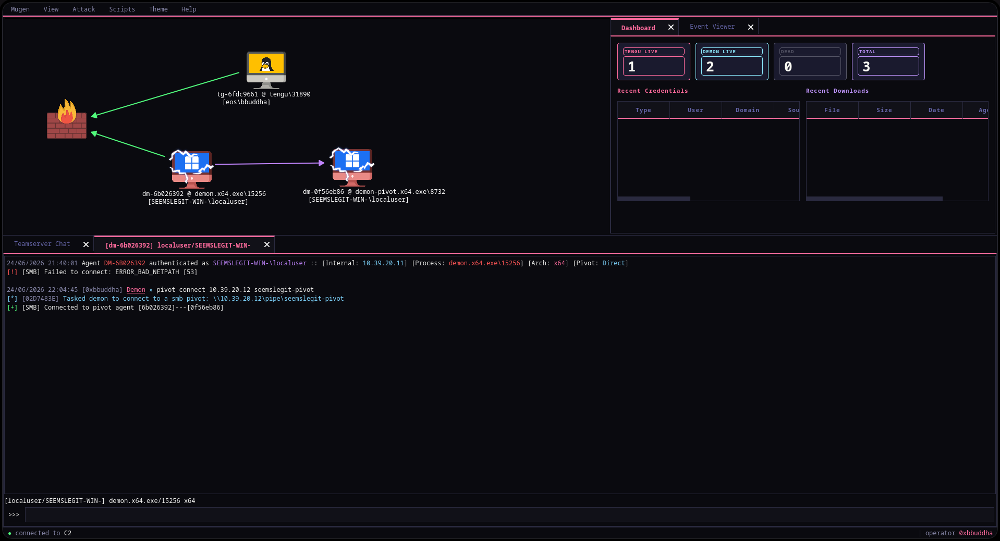
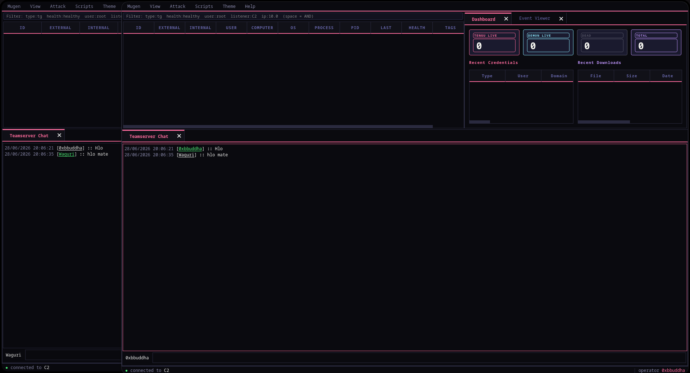

<div align="center">
  <br /><br />
  <h1>無限 Mugen</h1>
  <p><i>Open-source post-exploitation C2 framework. Forked from Havoc GPL-3.0.</i></p>
  <br/>
  <a href="https://github.com/MugenFramework/Mugen/blob/main/LICENSE"></a>
  <a href="https://github.com/MugenFramework/Mugen/releases"></a>
  
</div>

---

<div align="center">
  
  <br/><br/>
  
</div>

---

Mugen is a community-driven fork of [Havoc](https://github.com/HavocFramework/Havoc), the last GPL-3.0 release (December 2025). When Havoc transitioned to a commercial license in early 2026, we continued open development under the same GPL-3.0 terms.

**Mugen** means *infinite* (無限) in Japanese. No paywalls. No closed doors.

Includes **Demon** (Windows, C/ASM) and **Tengu** (Linux, C) agents, a Go teamserver, and a Qt5 client.

Maintained by [@0xbbuddha](https://github.com/0xbbuddha).

> Original copyright belongs to [@C5pider](https://twitter.com/C5pider) and Havoc contributors. See [CREDITS.md](CREDITS.md).

---

## Quick Start

**Supported:** Arch Linux, Debian 10/11, Ubuntu 20.04/22.04, Kali Linux

```bash
# Arch
sudo pacman -S git gcc base-devel cmake fontconfig glu gtest spdlog boost boost-libs \
    ncurses gdbm openssl readline libffi sqlite bzip2 mesa qt5-base qt5-websockets \
    python3 nasm mingw-w64-gcc

# Ubuntu / Kali
sudo apt install -y git build-essential cmake libfontconfig1 libglu1-mesa-dev libgtest-dev \
    libspdlog-dev libboost-all-dev libncurses5-dev libssl-dev libreadline-dev libffi-dev \
    libsqlite3-dev libbz2-dev mesa-common-dev qtbase5-dev qt5-qmake libqt5websockets5-dev \
    qtdeclarative5-dev golang-go python3-dev mingw-w64 nasm
```

```bash
git clone https://github.com/MugenFramework/Mugen
cd Mugen
make
```

`make` downloads the MinGW cross-compilers into `data/` (used by the default profile). After code changes, `make rebuild` is enough — it does **not** reinstall those compilers.

Do not `rm -rf data/` to reset loot or the database: that also deletes MinGW, and the teamserver will refuse to start. Wipe `data/loot/` and `data/teamserver.db` instead. If `data/` is already gone, restore the compilers with `make ts-build` (or `./teamserver/Install.sh`) then start the server.

```bash
# Teamserver
sudo ./mugen server --profile ./profiles/mugen.yaotl -v

# Client (separate terminal)
./mugen client
```

---

## Documentation

- [Installation guide](https://mugenframework.github.io/getting-started/installation/)
- [Operator manual](https://mugenframework.github.io/operator/sessions/)
- [Tengu agent reference](https://mugenframework.github.io/agents/tengu/)
- [Python API](https://mugenframework.github.io/python-api/overview/)
- [Roadmap](ROADMAP.md)

---

## Contributing

Mugen is a community project. All contributions are welcome - see [CONTRIBUTING.MD](CONTRIBUTING.MD).

---

## License

GPL-3.0 - see [LICENSE](LICENSE).

Original work copyright (C) C5pider and Havoc contributors.
Mugen modifications copyright (C) Mugen contributors.

---

## Disclaimer

Mugen is intended for authorized security testing only. Users are responsible for complying with applicable laws and obtaining proper authorization before use.
